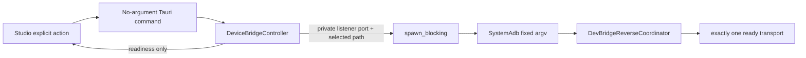

# User-gated Tauri Dev Bridge reverse mapping design

## Scope

M3 slice 3E turns the already user-selected ADB executable and already
running loopback Dev Bridge into one explicit, removable ADB reverse mapping.
Studio exposes a visible **Enable mapping** action and a visible **Remove
mapping** action. The implementation creates a mapping only when the user asks
for it, the Dev Bridge listener is running, and the typed coordinator finds
exactly one ready device.

This slice is intentionally narrower than runtime provisioning. It creates no
automatic mapping, SDK discovery, environment target selection, Pack push,
revision command, Android source change, background retry, mapping persistence
or app-exit cleanup. The native ADB executable path, selected serial, loopback
port, endpoint URL and bearer remain private to Rust.

## Alternatives considered

1. **Explicit mapping with explicit removal and stop-time cleanup — selected.**
   A user can see and control the only device-affecting action. Stopping the
   bridge is itself an explicit user action, so it first removes an active
   mapping and refuses to stop if cleanup fails. This avoids leaving a mapping
   pointed at a deliberately stopped listener.
2. **Create a mapping automatically after a successful preflight.** Rejected:
   a readiness probe does not prove that the user wants a vehicle-facing route
   or that the listener should be exposed at that moment.
3. **Silently remove mappings on application exit.** Rejected for this slice:
   it would launch a process without a new visible user action, races with
   desktop shutdown, and cannot make a failed cleanup recoverable in the UI.

## State and ownership

`DeviceBridgeController` continues to own the private `DevServerEndpoint` and
the in-memory canonical ADB executable selected by the native picker. It gains
a private mapping state machine:

| Internal state | Studio projection | Meaning |
|---|---|---|
| `Inactive` | `inactive` | No mapping is owned by this Studio session. |
| `Enabling` | `enabling` | One user-requested establish operation is in flight. |
| `Active` | `active` | One typed reverse mapping is owned privately. |
| `Removing` | `removing` | One user-requested cleanup is in flight. |
| `CleanupFailed` | `cleanupFailed` | A prior remove failed; the retained mapping can be retried. |

The public `DevBridgeMappingStatus` contains exactly its `readiness` enum. It
never serializes a serial, local/remote port, executable path, endpoint,
session ID, bearer, stdout or stderr. The private active value retains the
typed `ReverseMapping` and the `SystemAdb` client constructed from the
canonical executable. Selecting another executable is rejected while a mapping
is enabling, active, removing or awaiting cleanup, so a cleanup always uses
the same explicit executable.

The controller uses one private async mapping-operation gate around map,
remove and stop. It never holds the loopback-server or ADB-state mutex across
`spawn_blocking`. The gate prevents a stop operation from racing an establish
operation and prevents two renderer clicks from creating two mappings.

## Operations

Tauri exposes three no-argument commands:

- `get_device_bridge_mapping_status` returns the safe readiness projection.
- `enable_device_bridge_mapping` establishes one mapping.
- `disable_device_bridge_mapping` removes a retained mapping or retries a
  failed cleanup.

`enable_device_bridge_mapping` first verifies that the loopback bridge is
running and that a canonical executable is configured. It derives the local
port from the private `DevServerEndpoint::address()`, then in a blocking task
constructs `SystemAdb` and calls only
`DevBridgeReverseCoordinator::establish`. The coordinator performs its own
fresh `list_devices` and then, only for exactly one ready device, its fixed
`reverse` call. A successful result becomes private `Active` state. A failed
establish preserves the typed diagnostic and returns to `Inactive`; it never
attempts speculative cleanup.

`disable_device_bridge_mapping` runs only the retained mapping's typed
`remove` operation in a blocking task. Success becomes `Inactive`. Failure
preserves the adapter diagnostic and becomes `CleanupFailed`, allowing only an
explicit retry. Calling disable while inactive is idempotent and starts no
process.

`stop_device_bridge` takes the same operation gate. If a mapping is active or
awaiting cleanup, it executes the same private remove operation first. A
cleanup failure leaves the loopback listener running, retains
`CleanupFailed`, and rejects the stop request. Only a successful removal lets
the existing graceful listener shutdown proceed. No command automatically
maps, removes on app launch, or removes on app exit.

## Diagnostics and UI

The existing `device.adb.notConfigured`, selection diagnostics and adapter
diagnostics remain unchanged. This slice adds only controller-owned stable
codes where a portable adapter cannot express the condition:

| Code | Meaning |
|---|---|
| `device.bridge.notRunning` | A mapping was requested without a running loopback Dev Bridge. |
| `device.adb.mappingActive` | A new executable selection was requested while an owned mapping still requires its current executable. |

Studio keeps the ADB preflight and mapping states separate. The **Enable
mapping** control is disabled until the bridge is running, the preflight shows
`oneReadyDevice`, and no mapping operation is active. The controller does not
trust that cached UI state: it always re-lists devices when mapping, so stale
state cannot select a device. While active it shows **Remove mapping**; while
`cleanupFailed` it shows **Retry remove**. The UI renders only safe labels and
a generic action failure, never a raw diagnostic or private value.

## Testing and release gates

Rust tests inject one private ADB bridge adapter rather than launching ADB.
They prove that a stopped bridge and an unconfigured executable do not invoke
the adapter; successful mapping derives the actual private listener port;
only one mapping is created; duplicate enable is idempotent; cleanup failure
retains retryable state; stop removes before listener shutdown; and public JSON
contains only the readiness field. The fake adapter records operation order,
paths and typed ports without exposing them through a command result.

Tauri tests compile-check the three command symbols without opening a native
dialog or running ADB. TypeScript tests assert their exact no-argument names.
Browser-fixture and React tests prove that mapping stays disabled until the
bridge and ADB configuration are ready, then transitions through active and
explicit removal without displaying a path, serial or bearer.

The release gate remains Studio lint/test/build, Rust format/Clippy/workspace
test/release build and no-bundle Tauri debug compilation. No local or CI test
discovers or executes a real ADB binary.

## Follow-on boundary

This mapping gives a future runtime a device route to the authenticated
loopback listener but does not provision the private bearer or modify Android.
Future work must separately define runtime provisioning, application-exit
policy, Pack/revision transfer and remote-theme activation. Those features
must remain explicit consumers of the typed device contracts rather than new
renderer command surfaces.
